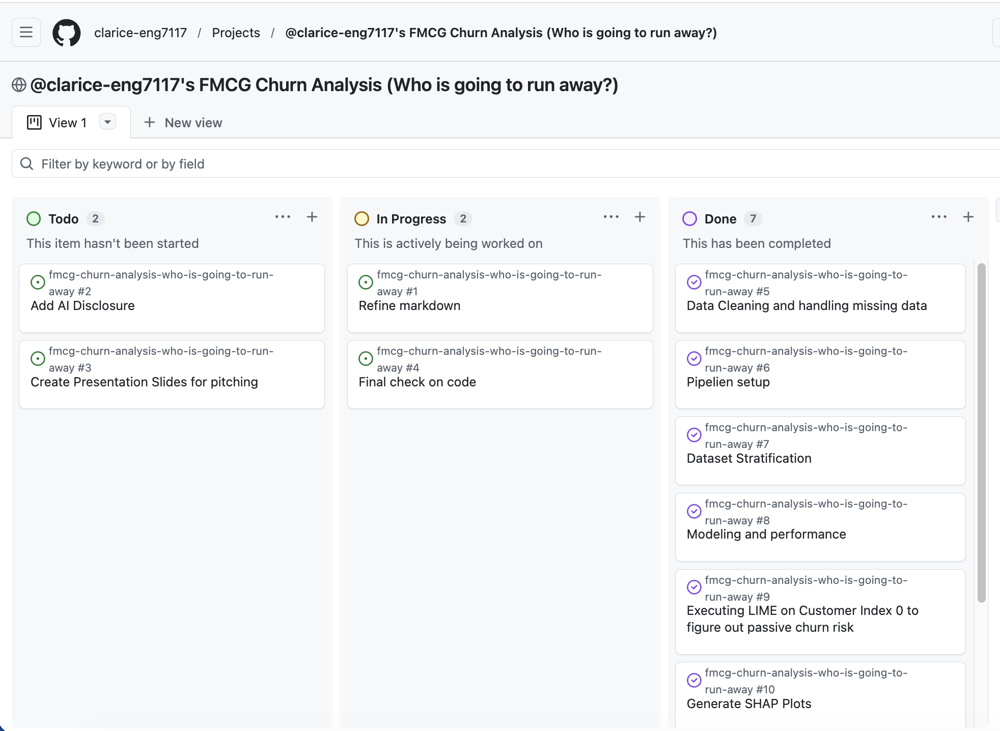

# 🛒 FMCG E-Commerce Churn Analysis & XAI Roadmap
Strategic Solutions Project: Predicting Attrition & Interpreting "Black Box" Logic

## 📊 Project Management & Task Tracking

To aligh with professional software development workflows, this project was tracked using **GitHub Projects**. 
- The live tracking environment can be viewed natively under the repository's [Projects] tab.

### Kanban Workflow screenshot:

  
## 🎯 Business Problem
In the FMCG sector, customer acquisition is 5-7x more expensive than retention. This project develops a predictive engine to identify at-risk customers and uses Explainable AI (XAI) to provide marketing teams with actionable intervention strategies.
  
## 🚀 Key Results
### Predictive Accuracy:   
Achieved a 0.91 F1-Score for the Churn class using a Random Forest Classifier.
    
### Recall:   
Successfully identified 84% of all churning customers prior to attrition.
    
### XAI Validation: 
Leveraged both SHAP and LIME to ensure model transparency and cross-validate feature impacts.
  
## 🛠️ The Tech Stack
Modeling: Python, Scikit-Learn (Random Forest)
  
Interpretability: SHAP (Global/Interaction), LIME (Local Validation)
  
Data Ops: Pandas, NumPy, Matplotlib/Seaborn
  
## 📊 Strategic Insights (The "So What?")
Through XAI analysis, three critical "Exit Triggers" were identified:
  
### The Honeymoon Phase:   
Customers in their first 90 days (low tenure) are highly sensitive; a single complaint in this window increases churn probability by over 40%.

### The Resilience Gap:   
Veteran customers are more forgiving of service issues, whereas new customers require immediate "Service Recovery" to prevent churn.

### Passive Churn Risk:   
Using LIME, we identified customers who appear "safe" (98% retention probability) but possess leading indicators of dissatisfaction (Score: 1/5), allowing for proactive outreach.

## 💡 Recommended Solutions
### The "First 90-Days" Shield:   
Automated onboarding sequences and "Month 2" loyalty incentives.

### Priority Recovery Protocol:   
Immediate escalation for complaints filed by low-tenure segments.

### Predictive Win-Back:   
Triggering engagement offers based on the DaySinceLastOrder thresholds identified by SHAP.

      
Author: Eng Kah Hui

Data Science (MSc) | AI (BSc) | Technical Solutions Analyst
